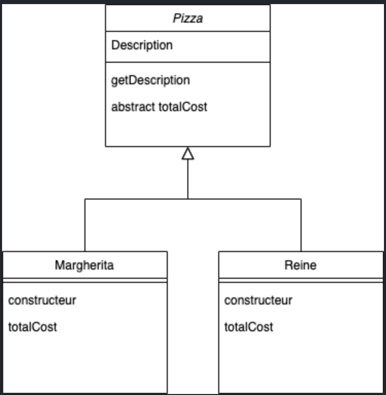
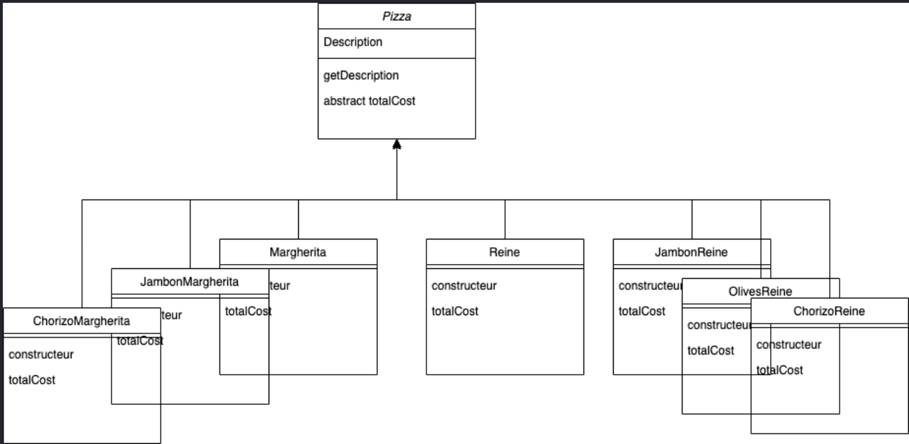
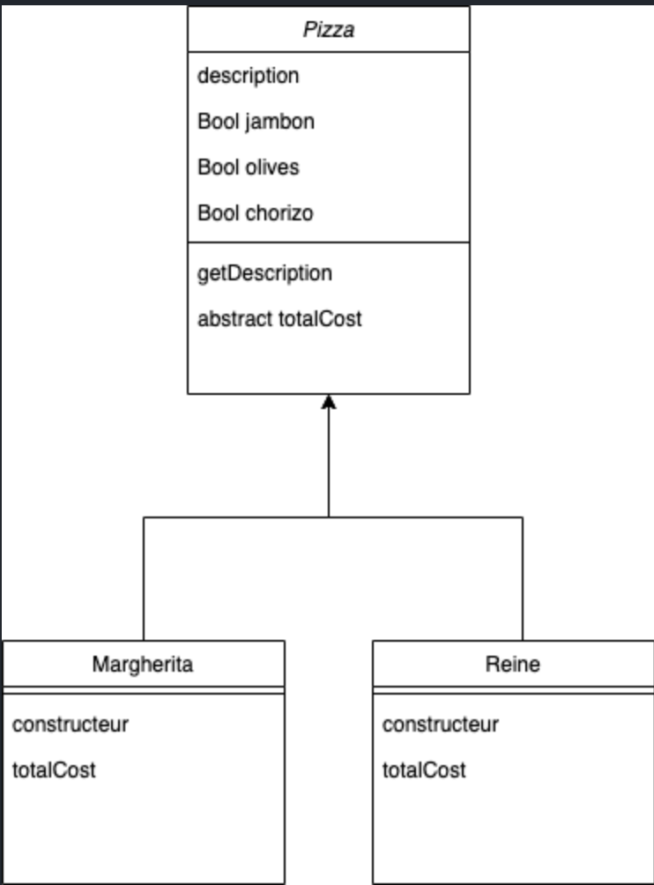
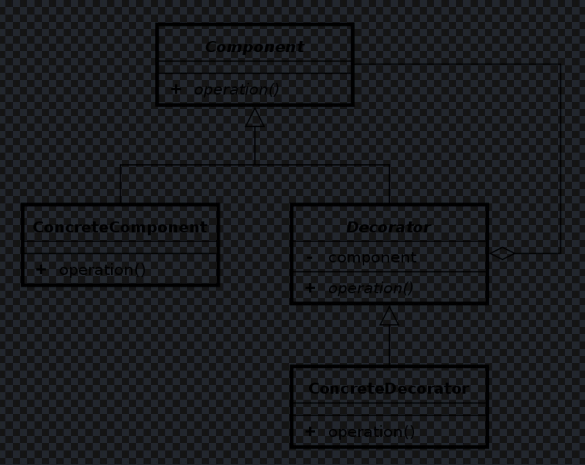

# __DECORATOR PATTERN__

> Rappel de principe de conception: Une classe doit être ouverte à l'extension mais fermée à la modification.

## __Quels problèmes ce patron peut résoudre ?__

- De nouvelles responsabilités doivent être ajoutées (ou retirées) à un objet dynamiquement en cours d'exécution.

- Étendre d'une classe de façon souple pour composer de nouvelles fonctionnalités

## __Solution qu'il apporte__

- Implémente une interface ou la classe abstraite de la classe à décorer

- Ajoute des fonctionnalités avant/après une requête

## __Exemple d'application__

### __Contexte__

J'ai une pizzeria qui vend en ligne:

Je veux donner la possibilité aux clients d'ajouter un supplément d'ingrédients dans la pizza:
- jambon
- olives
- chorizo
- ...

Propositions:

1.

Limites ?

2.

Limites ?

Solution:

Decorator pattern:

