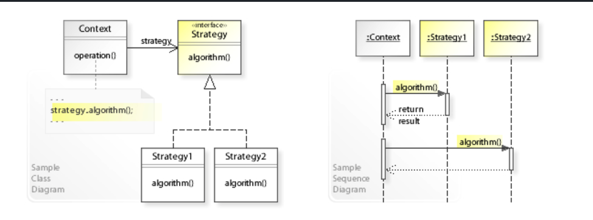

# __STRATEGY PATTERN__ (ou Policy)

> Rappel de principe de conception: Une classe doit être ouverte à l'extension mais fermée à la modification.

## __But__

Il définit une famille d'algorithmes, encapsule chacun d'entre eux et les rend interchangeable.

## __Quels problèmes ce patron peut résoudre ?__

- Difficulté d'ajouter de nouveaux algorithmes et changer les algorithmes existants sans casser le code existant (breaking changes).

- Utiliser le bon algorithme au bon moment.

## __Quand l'utiliser__

- Plusieurs classes liées diffère seulement dans leur comportement.

- Besoin d'une variation d'un algorithme.

- Une classe utilise plusieurs comportements et semble ressembler à des conditions.

Strategy pattern:

## __Exemple d'application__

### __Contexte__

J'ai un logiciel qui collecte des données et qui exporte ces données en TEXT, XML, CSV.

Je veux exporter les données en JSON.
